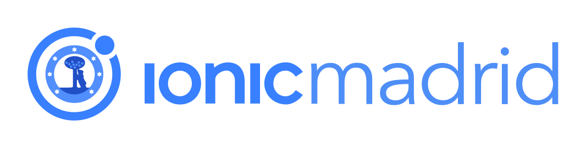

# Propuestas Ionic Madrid

## Código de Conducta

Ionic quiere proporcionar una experiencia de comunidad libre de acoso para todos, independientemente de su género, identidad o expresión de género, edad, orientación sexual, discapacidad, apariencia física, tamaño corporal, raza o religión (o ausencia de ella). No toleramos el acoso de los participantes de la comunidad en cualquier forma. El lenguaje obsceno y las imágenes sexuales son inapropiados para cualquier aspecto de esta comunidad, que incluye charlas, talleres, fiestas y medios digitales (Twitter, Facebook, Google+, o incluso mensajes de texto). Los participantes que violen estas reglas pueden ser sancionados o expulsados del grupo y todos los eventos futuros, a discreción de los organizadores.

## Code of Conduct

Ionic is dedicated to providing a harassment-free community experience for everyone, regardless of gender, gender identity and expression, age, sexual orientation, disability, physical appearance, body size, race, or religion (or lack thereof). We do not tolerate harassment of community participants in any form. Sexual or graphic language and imagery is inappropriate for any aspect of this community, including talks, workshops, parties, and digital media (Twitter, Facebook, Google+, or even text messages). Participants violating these rules may be sanctioned or expelled from the group and all future events at the discretion of the organizers.

## Propuestas

En [Ionic Madrid](https://www.meetup.com/Ionic-Madrid) ([@IonicMadrid](https://twitter.com/IonicMadrid))
buscamos gente que quiera compartir aspectos del desarrollo con [Ionic Framework](https://ionicframework.com), [Stencil](https://stenciljs.com) y [Capacitor](https://capacitor.ionicframework.com).

Si conoces Ionic y quieres compartir con la comunidad tus experiencias, *¡Bienvenid@!*

Crea un [_issue_](https://github.com/IonicSpain/IonicMadrid/issues/new)
para proponer una charla y sigue los pasos.

Contactaremos contigo para coordinar el evento y te avisaremos cuando la fecha esté cerrada.

No importa el nivel, sea de iniciación o avanzado.

Cuando haya varios eventos propuestas lanzaremos una encuesta a través del grupo de Meetup para priorizar en base al interés de los miembros del grupo.

## Call for Proposals

At [Ionic Madrid](https://www.meetup.com/Ionic-Madrid) ([@IonicMadrid](https://twitter.com/IonicMadrid))
we look for people who want to share aspects of development with [Ionic Framework](https://ionicframework.com), [Stencil](https://stenciljs.com) and [Capacitor](https://capacitor.ionicframework.com).

If you know Ionic and want to share your experiences with the community, *¡Welcome!*

Send an [_issue_](https://github.com/IonicSpain/IonicMadrid/issues/new)
to propose a talk and follow the steps.

We will contact you to coordinate the event and notify you when the date is closed.

The level does not matter, either initiation or advanced.

## Próximos meetups y anteriores

Puedes verlos todos en la [web del grupo en Meetup](https://www.meetup.com/Ionic-Madrid/events).

## Upcoming and past meetups

You can see them all in our [Meetup group website](https://www.meetup.com/Ionic-Madrid/events).

